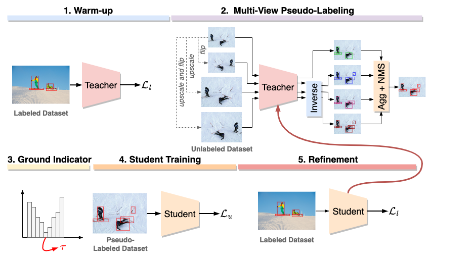

# Adaptive Self-Training for Object Detection

<p align="center"></p>

This repository contains the implementation of the following paper: "Adaptive Self-Training for Object Detection", that was paper presented at ICCVW2023.

This work presents a semi-supervised learning method for object detection.
This repository can be used to reproduce the main results of the paper.  
[[paper](https://openaccess.thecvf.com/content/ICCV2023W/LIMIT/papers/Vandeghen_Adaptive_Self-Training_for_Object_Detection_ICCVW_2023_paper.pdf)]

## bibtex
```
@inproceedings{Vandeghen2023Adaptive,
    author    = {Vandeghen, Renaud and Louppe, Gilles and Van Droogenbroeck, Marc},
    title     = {Adaptive Self-Training for Object Detection},
    booktitle = {Proceedings of the IEEE/CVF International Conference on Computer Vision (ICCV) Workshops},
    month     = {October},
    year      = {2023},
    pages     = {914-923}
}
```
# Usage

## Intsallation
```bash
conda create -n astod python=3.10
conda activate astod
pip install torch torchvision wandb tabulate
```

## Dataset
Organize the dataset as follows:
```bash
├── coco
│   ├── annotations
│   │   ├── instances_train2017.json
│   │   ├── instances_val2017.json
│   ├── train2017
│   ├── val2017
```

You can follow the preprocessing done in [STAC](https://github.com/google-research/ssl_detection/tree/master/prepare_datasets) to generate the different splits.
## Training
### Teacher
The first step of training is to train the teacher model. This can be done by running the following command on a remote server using SLURM:
```bash
seed=1
split=10

sbatch --output teacher.log teacher.sh $seed $split
```
### Labeling
Generate the candidate labels using the teacher model:
```bash
seed=1
split=10
sbatch --output labeling.log label.sh $seed $split
```

### Process the candidate labels
Process the candidate lables based on the score histogram:
```bash
seed=1
split=10
bins=21
sbatch --output process.log process.sh $seed $split $bins
```
This configuration will produce the same results presented in the paper.  
You can change the code argument in `process.sh` to change the configuration (fix threshold, global or per class threshold, etc.).

### Student
Train the student model using the pseudo-labels:
```bash
seed=1
split=10
sbatch --output student.log student.sh $seed $split
```

### Refinement
Refine the student model with the labeled data only:
```bash
seed=1
split=10
sbatch --output refine.log refine.sh $seed $split
```

### Iterative process
You can repeat the different steps by changing the teacher model by the student model for the [Labeling](#labeling) step.

## Acknowledgments
This repository is based on [torchvision](https://github.com/pytorch/vision/tree/main/references/detection).  
The authors also thanks all the different great open-sourced SSOD works.

## Authors
* **Renaud Vandeghen**, University of Liège (ULiège).